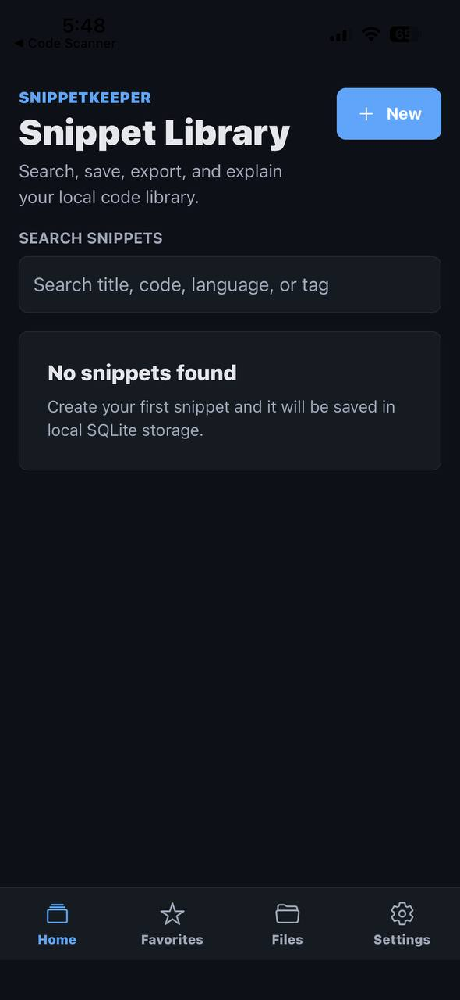
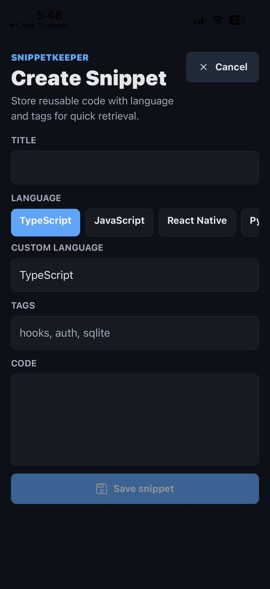
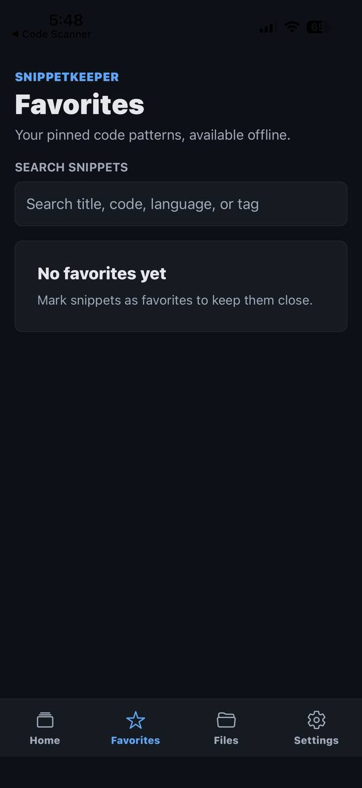
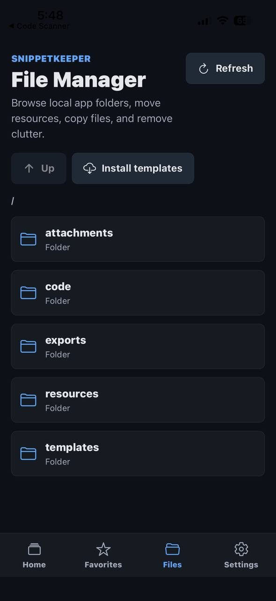
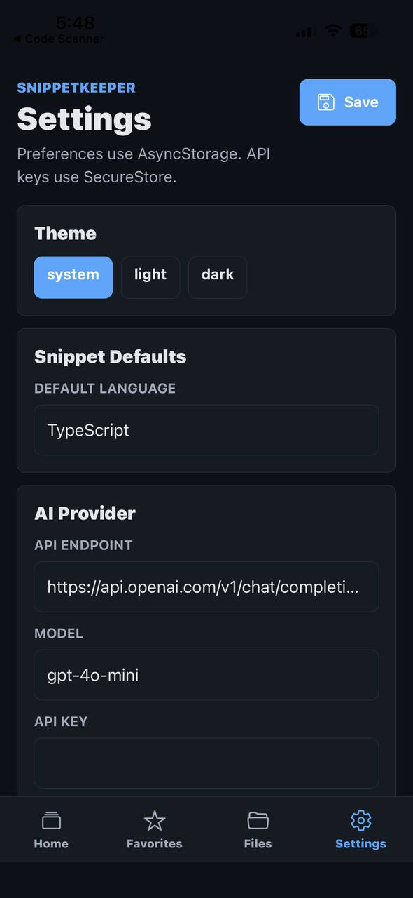

# SnippetKeeper

SnippetKeeper is an offline-first Expo SDK 54 mobile app for saving, organizing, exporting, and understanding reusable code snippets directly on a device.

# Demo video Link 
https://youtube.com/shorts/BjfNZeDQKSg?si=Jnd071U4Bhu9NcXR

## Tech Stack

- Expo SDK 54
- React Native 0.81
- React 19.1
- TypeScript
- Expo SQLite
- Expo FileSystem
- AsyncStorage
- SecureStore
- Expo Sharing
- Expo Image Picker

## Features

- Create, edit, delete, search, and favorite snippets
- Store snippets locally in SQLite for full offline CRUD access
- Attach screenshots to snippets and store them in app-local FileSystem folders
- Save snippet code files locally using the snippet language extension
- Export snippets as `.txt`, `.js`, and `.json`
- Share snippets or exported files with other applications
- Browse, delete, copy, and move local files in the File Manager
- Install local developer templates/resources for offline use
- Store app preferences in AsyncStorage
- Store AI API keys securely in SecureStore
- Generate AI explanations, summaries, and improvement suggestions with any OpenAI-compatible chat endpoint

## Screenshots

### Home



### Create Snippet



### Favorites



### File Manager



### Settings



## Run Locally

```bash
npm install
npm run start
```

Then open the app with Expo Go or an emulator.

## Database Structure

SQLite database: `snippetkeeper.db`

### `snippets`

| Column | Type | Purpose |
| --- | --- | --- |
| `id` | TEXT PRIMARY KEY | Local snippet identifier |
| `title` | TEXT | Snippet title |
| `code` | TEXT | Code content |
| `language` | TEXT | Programming language |
| `tags` | TEXT | JSON encoded tag array |
| `favorite` | INTEGER | Favorite flag |
| `explanation` | TEXT | AI explanation |
| `summary` | TEXT | AI summary |
| `suggestions` | TEXT | AI improvement suggestions |
| `created_at` | TEXT | ISO creation timestamp |
| `updated_at` | TEXT | ISO update timestamp |

### `attachments`

| Column | Type | Purpose |
| --- | --- | --- |
| `id` | TEXT PRIMARY KEY | Local attachment identifier |
| `snippet_id` | TEXT | Linked snippet |
| `file_uri` | TEXT | Local FileSystem URI |
| `name` | TEXT | Display filename |
| `type` | TEXT | Attachment type |
| `created_at` | TEXT | ISO creation timestamp |

Foreign keys are enabled, and attachment records cascade when a snippet is deleted.

## Offline Storage Approach

SnippetKeeper is local-first. The app initializes SQLite and FileSystem folders on startup, then reads and writes directly from local storage. Snippet creation, editing, deletion, search, favorites, saved code files, file browsing, exports, and screenshot attachment management work without an internet connection.

The only feature that requires network access is AI explanation generation. Existing AI responses are saved back into SQLite and remain readable offline.

## File Management Implementation

Expo FileSystem stores all app-managed files under:

```text
SnippetKeeper/
  attachments/
  code/
  exports/
  resources/
  templates/
```

The File Manager reads directories with `readDirectoryAsync`, inspects entries with `getInfoAsync`, and supports deleting, copying to `resources/`, moving to `exports/`, sharing files, and installing starter template files locally.

## AI Integration Workflow

1. The user saves an API key in Settings.
2. The key is stored with SecureStore.
3. Endpoint and model preferences are stored with AsyncStorage.
4. From a snippet detail screen, the app sends the snippet title, language, tags, and code to the configured chat endpoint.
5. The provider returns JSON containing `summary`, `explanation`, and `suggestions`.
6. The response is saved in SQLite beside the snippet for offline viewing.

## Submission Notes

Include the GitHub repository link, a demo video, and screenshots showing:

- Snippet creation and search
- Favorites
- Snippet detail view
- AI explanation result
- Export/share flow
- File Manager
- Settings with storage preferences
